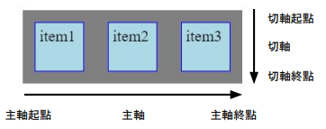
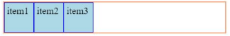
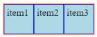
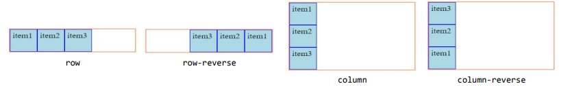
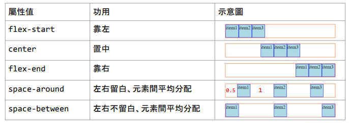
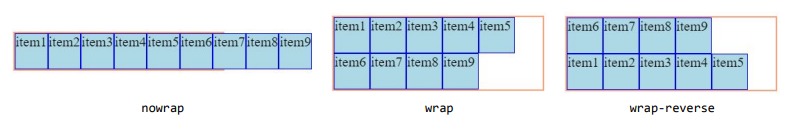
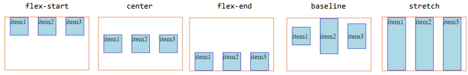
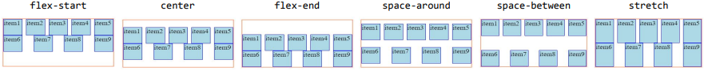

- ## [[CSS]]
- ### [[flex-box]]
- ## flex-box具有main axis 還有 cross axis
	- main axis: 內容`出發的方向`，有起點及終點。
	- cross axis: 內容超過時需要`換行的方向`。
	- 
- ## flex-box的display屬性
	- ^^`display: flex` | inline- flex;^^
	- 要創造彈性盒子要用display屬性。
		- `flex`: 將盒內元素並排呈現。
		- 
		- `inline-flex`: 將盒內元素並排呈現，並且盒子的大小`縮減成內容的大小`。
		- 
- ### display屬性範例
- ```html
  <div class="box flex">
      <div class="item">item1</div>
      <div class="item">item2</div>
  	<div class="item">item3</div>
  	<div class="item">item4</div>
  </div>
  
  <div class="box inline-flex">
      <div class="item">item1</div>
      <div class="item">item2</div>
  	<div class="item">item3</div>
  	<div class="item">item4</div>
  </div>
  ```
- ```css
  /* 外層容器 */
  .box{
    border: 2px solid lightsalmon;  
  }
  
  /* 內層元素(內容) */
  .item{
    width: 50px;
    height: 50px;
    border: 1px solid blue;
    background-color: lightblue;
    font-size: 20px;
    padding: 5px;
  }
  
  /* 設定彈性盒子 */
  .flex{
    display: flex;
  }
  
  .inline-flex{
    display: inline-flex;
  }
  ```
-
- ## 內容出發的方向 flex-direction屬性
	- ^^`flex-direction: row | row-reverse | row | column-reverse ;`^^
		- `row`: 並排呈現，由左而右。
		- `row-reverse`: 並排呈現，由又而左。
		- `column`: 垂直呈現，由上而下。
		- `column-reverse`: 垂直呈現，由下而上。
		- 
### display屬性範例
- ```html
  <div class="box row">
      <div class="item">item1</div>
      <div class="item">item2</div>
  	<div class="item">item3</div>
  </div>
  
  <div class="box inline-flex">
      <div class="item">item1</div>
      <div class="item">item2</div>
  	<div class="item">item3</div>
  	<div class="item">item4</div>
  </div>
  ```
- ```css
  /* 外層容器 */
  .box{
    border: 2px solid lightsalmon;
    display: flex;
  }
  
  /* 內層元素(內容) */
  .item{
    width: 50px;
    height: 50px;
    border: 1px solid blue;
    background-color: lightblue;
    font-size: 20px;
    padding: 5px;
  }
  
  /* 內容出發的方向 */
  .row {
    flex-direction: row;
  }
  
  .row-reverse {
    flex-direction: row-reverse;
  }
  
  .column {
    flex-direction: column;
  }
  
  .column-reverse {
    flex-direction: column-reverse;
  }
  ```
-
- ## 對齊方式(主軸) justify-content屬性
- ^^`justify-content: flex-start | center | flex-end`;^^
	- | 屬性值|功用|
	  |flex-start|靠左|
	  |center   |置中|
	  |flex-end|靠右|
	  |space-around|左右留白，元素間平均分配|
	  |space-between|左右不留白，元素間平均分配|
	- 
### display屬性範例
- ```html
  <div class="box flex-start">
      <div class="item">item1</div>
      <div class="item">item2</div>
  	<div class="item">item3</div>
  </div>
  
  <div class="box ...">
      <div class="item">item1</div>
      <div class="item">item2</div>
  	<div class="item">item3</div>
  	<div class="item">item4</div>
      <div class="item">item5</div>
  </div>
  ```
- ```css
  /* 外層容器 */
  .box{
    border: 2px solid lightsalmon;
    display: flex;
    flex-direction: row;
  }
  
  /* 內層元素(內容) */
  .item{
    width: 50px;
    height: 50px;
    border: 1px solid blue;
    background-color: lightblue;
    font-size: 20px;
    padding: 5px;
  }
  
  /* 內容出發的方向 */
  .row {
    flex-direction: row;
  }
  
  .row-reverse {
    flex-direction: row-reverse;
  }
  
  .column {
    flex-direction: column;
  }
  
  .column-reverse {
    flex-direction: column-reverse;
  }
  ```
- ## 換行方式 flex-wrap屬性
- ^^flex-wrap: nowrap | wrap | wrap-reverse ;^^
- 設定flex-box中內容的換行方式
	- `nowrap`: 所有內容單行顯示，不換行
	- `wrap`: 由切軸起點開始
	- `wrap-reverse`: 換行，由切軸終點開始
	- 
- ### 換行方式 flex-wrap屬性 範例
- ```html
  <div class="box nowrap">
      <div class="item">item1</div>
      <div class="item">item2</div>
  	<div class="item">item3</div>
      <div class="item">item4</div>
      <div class="item">item5</div>
      <div class="item">item6</div>
      <div class="item">item7</div>
      <div class="item">item8</div>
      <div class="item">item9</div>
  </div>
  
  <div class="box ...">
      <div class="item">item1</div>
      <div class="item">item2</div>
  	<div class="item">item3</div>
  </div>
  ```
- ```css
  /* 外層容器(彈性盒子) */
  .box{
    border: 2px solid lightsalmon;
    display: flex;
    flex-direction: row;
    justify-content: flex-start;
    width: 300px;
  }
  
  /* 內層元素(內容) */
  .item{
    width: 50px;
    height: 50px;
    border: 1px solid blue;
    background-color: lightblue;
    font-size: 20px;
    padding: 5px;
  }
  
  /* 換行方式 */
  .nowrap {flex-wrap: nowrap;}
  .wrap {flex-wrap: wrap;}
  .wrap-reverse {flex-wrap: wrap-reverse;}
  ```
- ## 單行對齊方式(切軸) align-items 屬性
- 單行對齊方式(切軸)
- ^^`align-items: flex-start | center | flex-end | baseline | stretch ;`^^
	- 設定flex-box中內容的切軸對齊方式(單行)。
	- `flex-start`: 對齊切軸起點。
	- `center`: 對齊切軸起點。
	- `flex-end`: 對齊切軸終點。
	- `baseline`: 對齊文字。
	- `stretch`: 如內容的無設定高度，會自動站滿全部。(預設值)
	- 
- ```html
  <div class="box flex-start">
      <div class="item">item1</div>
      <div class="item">item2</div>
  	<div class="item">item3</div>
  
  </div>
  
  <div class="box ...">
      <div class="item">item1</div>
      <div class="item">item2</div>
  	<div class="item">item3</div>
  </div>
  ```
- ```css
  /* 外層容器(彈性盒子) */
  .box{
    border: 2px solid lightsalmon;
    display: flex;
    justify-content: space-around;
    width: 300px;
  }
  
  /* 內層元素(內容) */
  .item{
    width: 50px;
    height: 50px;
    border: 1px solid blue;
    background-color: lightblue;
    font-size: 20px;
    padding: 5px;
  }
  
  /* 展示baseline要設定items文字高度*/
  .lh50{ height: 50px; line-height: 50px;}
  .lh70{ height: 50px; line-height: 50px;}
  .lh100{ height: 50px; line-height: 50px;}
  
  /* 換行方式 */
  .flex-start {align-items: flex-start;}
  .center {align-items: center;}
  .flex-end {align-items: flex-end;}
  .baseline {align-items: baseline;}
  .stretch {align-items: stretch;}
  ```
- ## 單行對齊方式(切軸) align-content屬性
	- 多行對齊方式(切軸)
	- ^^``align-content: flex-start | center | flex-end | stretch....;``^^
	- 設定flex-box中內容的切軸對齊方式(多行)。
	- `flex-start`: 對齊切軸起點。
	- `center`: 對齊切軸正中心。
	- `flex-end`: 對其切軸終點。
	- `space-around`: 上下留白、平均分配間隔。
	- `space-between`: 上下不留白、平均分配間隔。
	- `stretch`: 如內容的無設定高度，會自動占滿全部。(預設值)
- 
- ### 單行對齊方式(切軸) align-content屬性 範例
- ```html
  <div class="box flex-start">
      <div class="item">item1</div>
      <div class="item">item2</div>
  	<div class="item">item3</div>
      <div class="item">item4</div>
      <div class="item">item5</div>
      <div class="item">item6</div>
      <div class="item">item7</div>
      <div class="item">item8</div>
      <div class="item">item9</div>
  </div>
  
  <div class="box ...">
      <div class="item">item1</div>
      <div class="item">item2</div>
  	<div class="item">item3</div>
  </div>
  ```
- ```css
  /* 外層容器(彈性盒子) */
  .box{
    border: 2px solid lightsalmon;
    display: flex;
    justify-content: space-around;
    width: 300px;
    height: 150px;
    flex-wrap: wrap;
  }
  
  /* 內層元素(內容) */
  .item{
    width: 50px;
    height: 50px;
    border: 1px solid blue;
    background-color: lightblue;
    font-size: 20px;
    padding: 5px;
  }
  
  /* 展示baseline要設定items文字高度*/
  .lh50{ height: 50px; line-height: 50px;}
  .lh70{ height: 50px; line-height: 50px;}
  .lh100{ height: 50px; line-height: 50px;}
  
  /* 切軸對齊方式(多行) */
  .flex-start {align-items: flex-start;}
  .center {align-items: center;}
  .flex-end {align-items: flex-end;}
  .space-around {align-content: space-around;}
  .space-between {align-content: space-between;}
  .stretch {align-items: stretch;}
  ```
-
- ## flex-items的相關設定
- ### flex-items的伸展
	- ^^`flex-grow: 0 | ∞`^^
	- 當flex-box有剩餘空間時，設定flex-grow屬性可以分配剩餘空間並伸展。
	- 不伸展為0(預設值)。
- ### flex-tiems的伸展
	- ^^`flex-shrink: 0 | ∞`^^
	- 收縮值為1(預設值)，不收縮為0。
- ### flex-items的寬度
	- ^^`flex-basis: 長度單位...`^^
	- 設定flex-items的寬度，使用flex-basis屬性。
	- 寬度權重: max-width/min-width > flex-basis > width。
- ### flex-items的相關設定 範例
- ```html
  <div class="box">
      <div class="item flex-grow">item1</div>
      <div class="item">item2</div>
  	<div class="item">item3</div>
  
  </div>
  
  <div class="box width500">
      <div class="item width200">item1</div>
      <div class="item width200">item2</div>
  	<div class="item width200 flex-shrink">item3</div>
  </div>
  
  <div class="box">
      <div class="item">item1</div>
      <div class="item flex-basis">item2</div>
  	<div class="item">item3</div>
  </div>
  ```
- ```css
  /* 外層容器(彈性盒子) */
  .box{
    border: 2px solid lightsalmon;
    display: flex;
    justify-content: space-around;
    width: 800px;
    height: 150px;
    flex-wrap: wrap;
  }
  
  /* 內層元素(內容) */
  .item{
    width: 50px;
    height: 50px;
    border: 1px solid blue;
    background-color: lightblue;
    font-size: 20px;
    padding: 5px;
  }
  
  /* 展示baseline要設定items文字高度*/
  .lh50{ height: 50px; line-height: 50px;}
  .lh70{ height: 50px; line-height: 50px;}
  .lh100{ height: 50px; line-height: 50px;}
  /* flex-items的伸展*/
  .flex-grow{flex-grow: 1;}
  /* flex-items的收縮*/
  .width500{ width: 500px;}
  .width200{ width: 200px;}
  .flex-shrink{ flex-shrink: 0; }
  /* flex-items的寬度設定*/
  /* flex-items的收縮*/
  ```
- ## flex-items 的相關設定
	- ### flex-items的個別對齊方式(切軸)
		- ^^`align-self: flex-start | start ...;`^^
		- 個別設定flex-items的切軸對齊方式，使用align-self屬性。
		- 包含flex-start、center、flex-end、flex-end、baseline、strectch。
	- ### flex-items的排列順序
		- ^^`order: 數值;`^^
		- 個別設定flex-items的排列順序，使用order屬性。
		- 不需要修改html元素順序。
		- ```css
		  /* 外層容器(彈性盒子) */
		  .box{
		    border: 2px solid lightsalmon;
		    display: flex;
		    justify-content: space-around;
		    width: 800px;
		    height: 150px;
		    flex-wrap: wrap;
		  }
		  
		  /* 內層元素(內容) */
		  .item{
		    width: 50px;
		    height: 50px;
		    border: 1px solid blue;
		    background-color: lightblue;
		    font-size: 20px;
		    padding: 5px;
		  }
		  
		  /* 展示baseline要設定items文字高度*/
		  .lh50{ height: 50px; line-height: 50px;}
		  .lh70{ height: 50px; line-height: 50px;}
		  .lh100{ height: 50px; line-height: 50px;}
		  /* flex-items的伸展*/
		  .flex-grow{flex-grow: 1;}
		  /* flex-items的收縮*/
		  .width500{ width: 500px;}
		  .width200{ width: 200px;}
		  .flex-shrink{ flex-shrink: 0; }
		  /* flex-items的寬度設定*/
		  /* flex-items的收縮*/
		  ```
		-