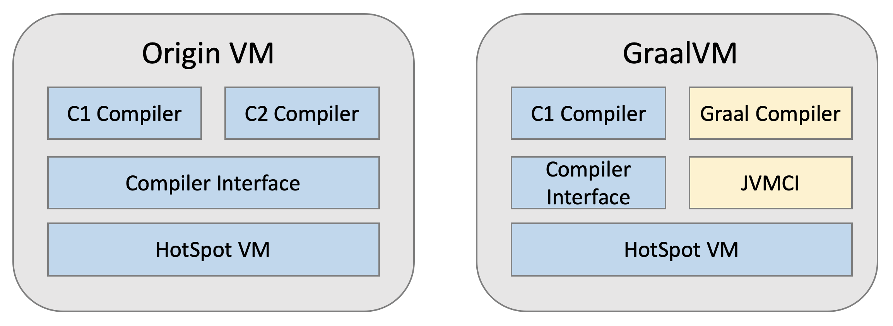
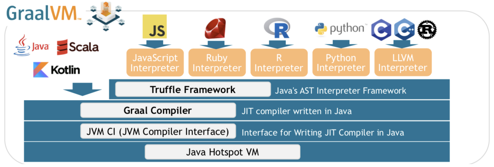
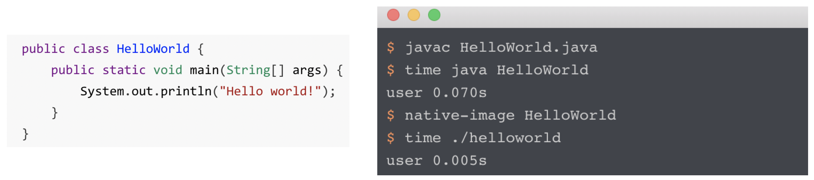
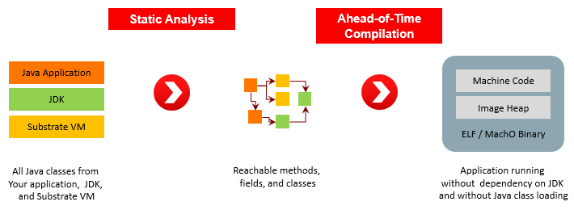
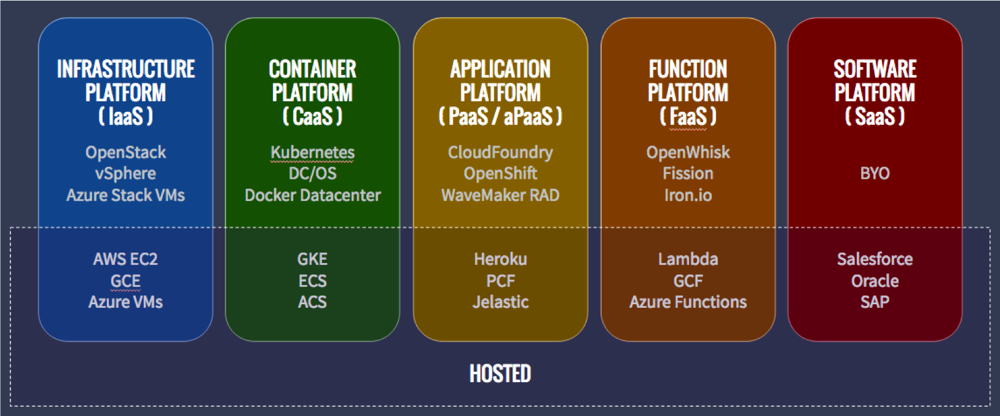

## [[Graalvm]]
-
- ### 三大特點
- 1. ^^High-performance modern Java^^ : 使用 GraalVM 執行 Java 程式可以變得更快
- 2. ^^Polyglot^^ : 可以在 Java 裡面同時使用多種語言，像是 JavaScript、R…
- 3. ^^Instant startup, low footprint^^ : 直接把 Java program compile 成 machine code，執行起來體積更小、啟動更快
- ### ^^High-performance modern Java^^
- High-performance modern Java 使用到了 Graal compiler 技術，Graal compiler 是一個 JIT compiler，並且是使用 Java 撰寫的，目的是拿來替換掉原本 HotSpot VM 的C2 compiler
-
- 為了讓 Graal compiler 可以更彈性的被更新（總不能每發布一次 Graal compiler 更新就要重新 compile 整個 java），Oracle 加上了一層JVM Compiler Interface，簡稱 JVMCI，把原本那些應該由 C2 執行的請求抽象化成 interface，解耦 C1 compiler 和 Graal compiler 的連結，讓 Graal 可以更輕易的被更新
- 
- 雖然 Graal 是使用 java 寫的，難免會讓人聯想到性能會比不上 C2 compiler，但是在各種實驗之後，得到的數據顯示對於 Java program，Graal 和 C2 compiler 的能力幾乎不相上下（在已經預熱完畢的前提下），而對於 Scala program，Graal 更是達到 10% 以上的優化，這也是為什麼 Twitter 大規模的使用 GraalVM 替換掉原本的 HotspotVM
-
- 不過在啟動時，GraalVM 會比 HotspotVM 還慢，原因是必須先將 Graal 編譯成 machine code，這個是無可避免的，只是當預熱完畢時，Graal 和 C2 compiler 的性能不相上下，並且根據 Graal 的版本不斷更新，這個數據只可能會更好
-
- ### ^^Polyglot^^
- 為了讓Java能夠在一次的Runtime中執行多種語言
- Java 使用 Truffle framework ，只要有該語言的 Interpreter就能使用該語言
- {:height 272, :width 778}
- ```java
  public class Main {
      public static void main(String[] args) {
          System.out.println("Hello World from Java!");
  
          Context context = Context.newBuilder().allowAllAccess(true).build();
  
          context.eval("js", "print('Hello World from JavaScript!');");
          context.eval("python", "print('Hello World from Python!')");
          context.eval("ruby", "puts 'Hello World from Ruby!'");
      }
  }
  ```
- ```output
  Hello World from Java!
  Hello World from JavaScript!
  Hello World from Python!
  Hello World from Ruby!
  ```
- ### ^^Instant startup, low footprint^^
- GraalVM 還有最後一項技術，就是 native image，他是在 compile time時，就將 Java program 直接 compiler 成 binary 的 machine code，讓這個程式可以像一般二進制的檔案被運行
-
- Native images compiled with GraalVM ahead-of-time improve the startup time and reduce the memory footprint of JVM-based applications.
- 
- Native-image 帶來的好處是可以更快速的啟動一個 java program，以往如果要啟動 java 程式，需要先啟動 jvm 再載入 java code，然後再即時的 compile bytecode to machine code，非常耗時和耗 memory，而如果使用 native-image，可以取得一個更小更快速的鏡像，適合用在 cloud deploy
-
- native image 之所以可以快速啟動，是因為他做了 Ahead-of-time compile，在 compile time 時，會把所有相關的東西，包含一個 Substrate VM，一起 compile 成 machine code，這個 SubstrateVM 是 GraalVM 才有的東西，他只包含最基本的 thread scheduling、垃圾回收，盡可能的縮小必要的 jvm 體積
- 
- 雖然 native image 感覺很猛，但是他也有不可抹滅的缺點，就是使用 native image 的程式，throughput 會下降，原因是因為 java 程式很大一部分的優化都在 JIT compiler 中
-
- 還有另一個缺點是，native image 並沒有辦法動態的加載類（因為所有東西必須要在 compile time 就決定好），所以也沒辦法使用反射等相關機制，不過對於這個問題，GraalVM 也有提出相對應的解法，就是在 compile 時，把所有可能的類全部 compile 進來，所以反射機制還是可以支持的，不然的話，整個 Spring framework 就不能使用 native image 了
-
- 目前 Spring 5 也打算開始支持 GraalVM native-image 的開箱即用設定，可以看到 serverless 的 java program 可能是之後的趨勢
-
- 補充一下，serverless 就是指 Fuction as a Service，他的目的是希望 program 不用一直 run 著，當有請求來的時候，我快速啟動這個 program，然後請求走我就 shutdown 這個 program，不讓 program 一直啟動著，而是有需要的時候才開啟他，也就是說，FaaS 就是讓這個 program 像是 function 一樣，用完即走，因此 native-image 的快速啟動非常符合FaaS的需求
- 
- 安裝方式與其他JVM相同